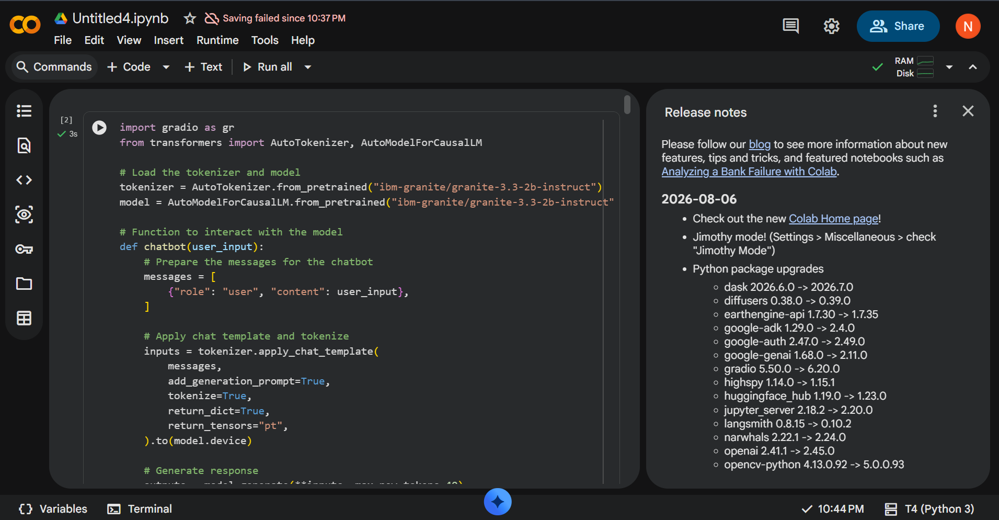

# Generative AI Audiobook Creator

A Generative AI application developed as part of a hackathon project. The application uses IBM Granite to generate and rewrite text and provides audio narration through text-to-speech.

## Features

- AI-powered text generation using IBM Granite
- Tone-based text rewriting
- Text-to-speech audio generation
- Multiple voice options
- Audio speed and pitch adjustment
- Noise addition and noise reduction
- Text and PDF to audiobook conversion
- Interactive Gradio interface

## Technologies Used

- Python
- IBM Granite
- IBM Watson Text-to-Speech
- Hugging Face Transformers
- Gradio
- gTTS
- Librosa
- Pydub
- PyPDF2

## Project

This project was developed as a team-based hackathon project to explore Generative AI and audio-based applications.
## Project Description

This project combines Generative AI and Text-to-Speech technology to create an interactive audiobook creator. Users can generate or rewrite content using IBM Granite and convert the resulting text into audio narration.

## How to Run

1. Install the required Python libraries.
2. Run the application using:

```bash
python audiobook_creator.py

3. Open the Gradio interface in your browser.

## Author

Nivashini-hub
python audiobook_creator.py


## Project Demo


